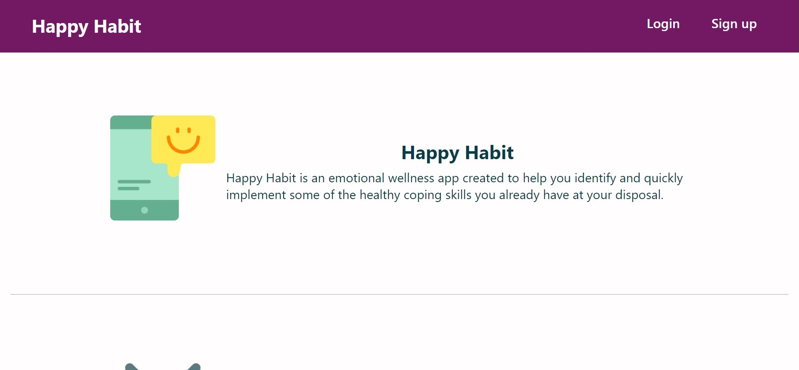
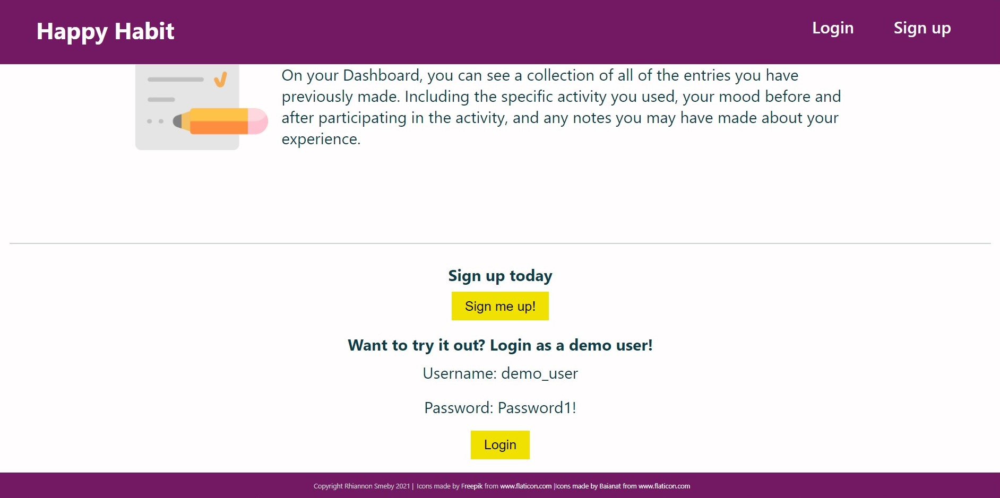
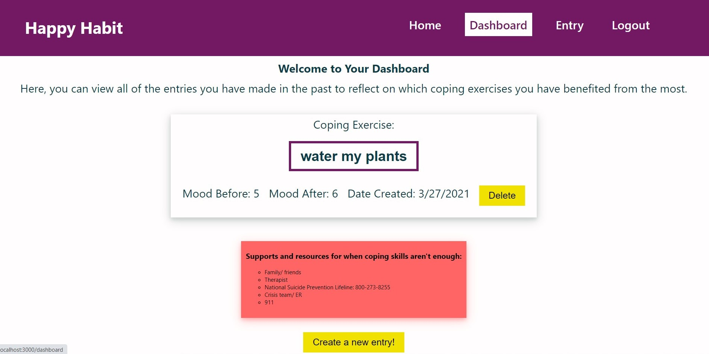
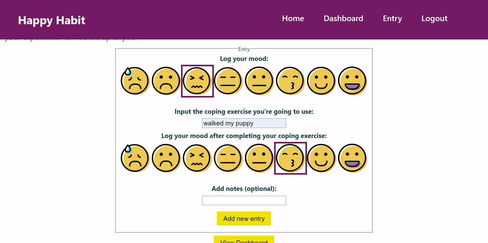

# Happy Habit

This project was bootstrapped with [Create React App](https://github.com/facebook/create-react-app).

### Live App: 
### Server Repo: https://github.com/rhiannonsmeby/happy-habit-server

### Screenshots

### Summary
Happy Habit helps users manage their emotions by providing them with a user-friendly way to log their moods and coping exercises. 

### Technology Used
* React.js
* HTML
* CSS
* Node.js
* Express

### Contact the Developer
* smebyrhi@gmail.com